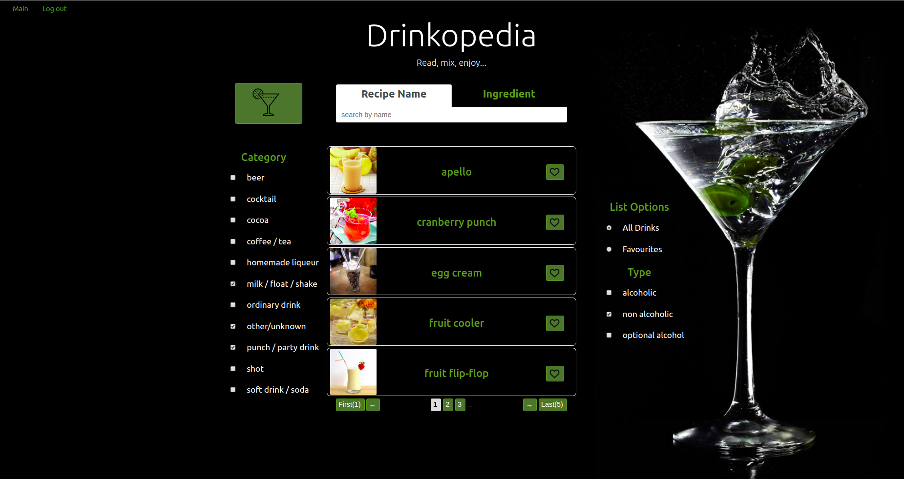
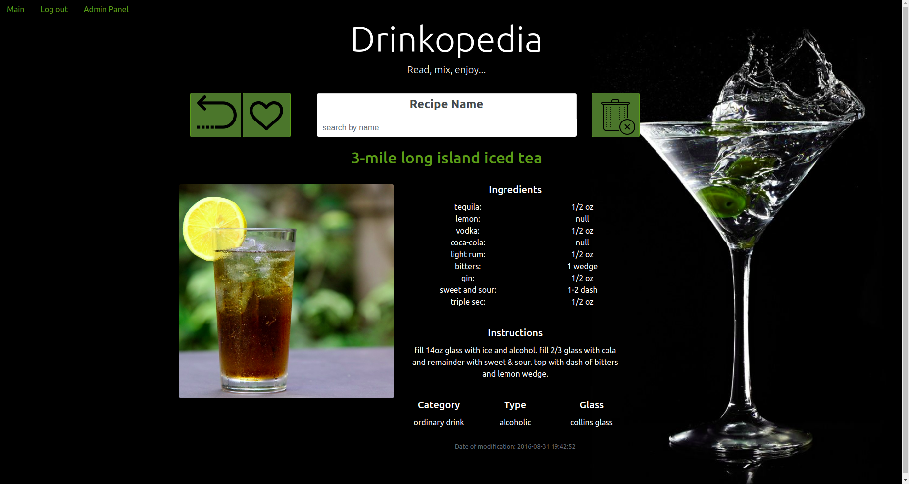
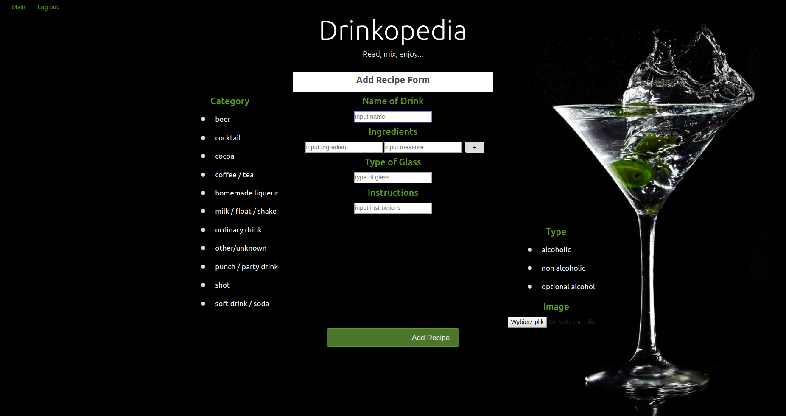
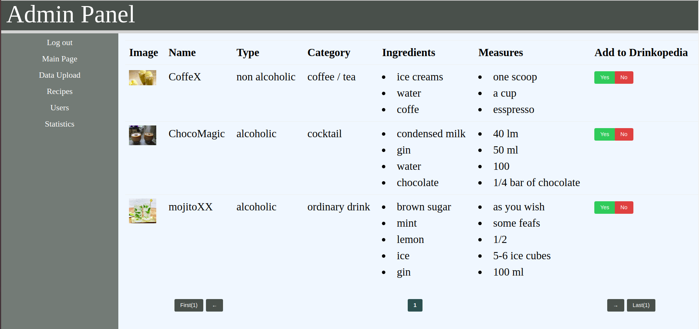
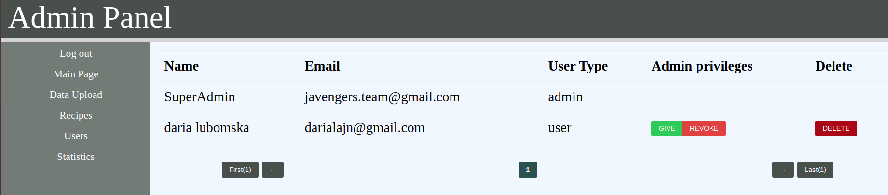
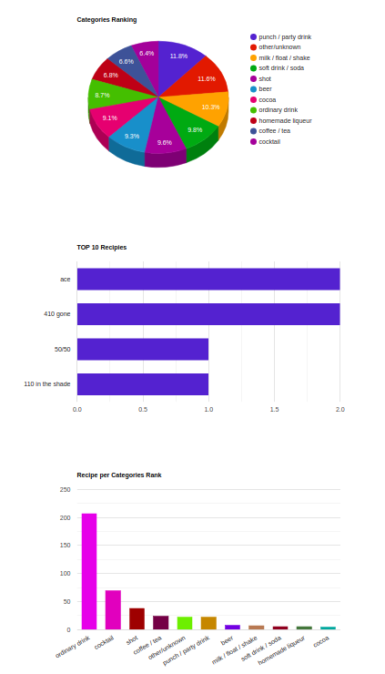

# Drinkopedia
> The web application called Drinkopedia is user-friendly source of recipes for drinks and cocktails. Let's assume that you have some ingredients in the fridge and wonder what to make of them. This application will allow you to conjure up unusual drinks with your ingredients!

## Table of contents
* [Overview](#overview)
* [Features](#features)
* [Technologies](#technologies)
* [Team](#team)
* [Acknowledgements](#acknowledgements)

## Overview
> The project is based on external REST Api, which is consumed to gain recipes data. The main features such as user and recipes management or live search and filtration of recipes were implemented as a REST endpoints. An registered user can add new recipe or manage his favourites recipes. Admin decides about accepting or rejecting requested new recipe also has the ability to manage registered users sucha as grand or revoke admin privileges or access recipes statistics.

## Features

### User authentication and authorization
> The user authentication process is carried out with Google OAuth Authentication system. Application user's authorization has three levels: guest, user and admin. Users are registered after Google authentication, new ones (not exitisng in application database) are added to the database and could logs into theirs accounts. Available functionalities depends on authorization levels.

### Recipes live search, filtration nad favourities
 
> Live search functionality includes ingredients and recipe names for user-friendly recipes searching. You can imagine, that in you fridge you could find lemon, pineapple and vodka.. what you can make with theme..just enter ingredients, then mix and enjoy! You can also filter recipes by category and type, and browse your favorite drinks.

### Recipe single view
 
> Clicking on the recipe on main page redirect to single view of there recipe. There you can find more detailed information such as ingredients nad instruction needed to prepare drinks. Also you can add recipe to your favourities or remove from there and as a admin remove recipe from database.

### Age check
> Recipes with alcohol are only available for above 18 years old users, so at the beginning you will see pop-up with confirmation of user age. User choice is saved in cookies for 24h. 

### Add new recipe

> The users and admins has the ability to add new recipe by form, which require name of drink, ingredients and its measures, preferred glass type for serving a drink, instruction to prepare, category and type of drink and in the end file uploading of drink photo.

### Admin management panel
Users marked as a super admin cannot be removed od edited by any other user. Functionalities of Admin management panel is using REST API and AJAX technology, providing all actions such as delete user without page reload.

#### JSON file upload and load recipes to database
> Administrator's management panel has the functionality that allows admins to uplad JSON file and store drinks data in MySQL database. This is an alternative way to retrieve recipes data, when external service REST API is not available.

#### Accept or reject new recipe request

> Each admin has the ability to accept or reject newly requested recipe comes from user or another admin.

#### Grant/Revoke admin privileges and delete users

> Users with admin privileges and super admin has the ability to manage admins privileges of another users also can delete user. Super admin is unedited and irremovable.

#### Statistics

> Each administrator has an access to statistics module, which was carried out with Google Charts and using AJAX. There three charts are available:
* Categories Rank - viewed categories relative to each other
* TOP 10 Recipes - top 10 the most viewed recipes
* Recipes per Category Rank - there is a presentation of recipes per category

### Loggers
> Logs from application and server are logged to the console (level INFO) and to external file(level DEBUG) - WildFly configuration standalone.xml file

### Error pages
> Customized Error pages were prepared for HTTP status codes: 404 and 500 and for exceptions to avoid undesirable stack traces.

## Technologies
* Java SE 11
* Java EE 8
* Wildfly 17.0.1
* MySQL 8.0.15
* Hibernate ORM 5.4.2.Final
* FasterXML/Jackson 2.10.1
* Maven 3.3.9
* Jenkins CI/CD
* OAuth 2.0
* SLF4J 1.7.28
* Freemarker 2.3.29
* Bootstrap 4.3.1
* HTML5, CSS3, JS
* jQuery, AJAX
* REST API
* Docker
* Google Charts

## Team
The project was created by Javengers team:

| <a href="https://github.com/klaudia-zarychta" target="_blank">**Klaudia Zarychta**</a> | <a href="https://github.com/szypul86" target="_blank">**Andrzej Szypulski**</a> | <a href="https://github.com/daria-lubomska" target="_blank">**Daria Lubomska**</a> |
| :---: |:---:| :---:|
|     |  |   |

## Acknowledgements
The project was created during Junior Java Developer course led by infoShare Academy. We would like to thank our project supervisor [@Rafał Misiak](https://github.com/rafalmisiak) and all lecturers.
